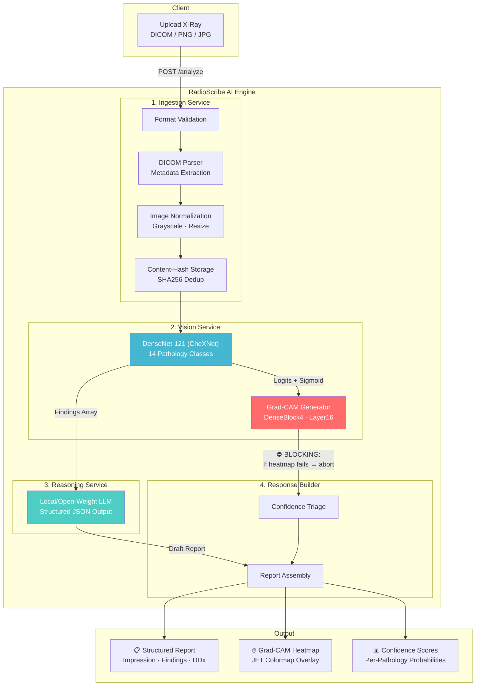

<p align="center">
  <a href="https://radioscribe.me">
    
  </a>
</p>

<h1 align="center">
  <a href="https://radioscribe.me">🩻 RadioScribe AI Engine</a>
</h1>

<p align="center">
  <strong>Production-Grade AI Radiology Co-Pilot</strong><br/>
  <em>CheXNet (DenseNet-121) · Grad-CAM Explainability · Local/Open-Weight LLM Reasoning · FastAPI</em><br/>
  <br/>
  🌐 <strong>Live Demo: <a href="https://radioscribe.me">radioscribe.me</a></strong>
</p>

<p align="center">
  <a href="#"></a>
  <a href="#"></a>
  <a href="#"></a>
  <a href="#"></a>
  <a href="#"></a>
  <a href="LICENSE"></a>
</p>

<p align="center">
  <a href="#features">Features</a> •
  <a href="#architecture">Architecture</a> •
  <a href="#quick-start">Quick Start</a> •
  <a href="#api-reference">API Reference</a> •
  <a href="#deployment">Deployment</a> •
  <a href="docs/architecture.md">Docs</a>
</p>

---

## Overview

**RadioScribe AI** is a production-grade medical imaging analysis engine that transforms Chest X-rays into structured radiology reports. It combines deep learning (CheXNet/DenseNet-121) with local/open-weight clinical reasoning to produce draft findings — complete with Grad-CAM visual explainability.

> ⚠️ **Disclaimer**: This system is designed for **clinical decision support only**. It does not provide diagnoses. All outputs require radiologist review. See [Safety Architecture](#safety-architecture).

---

## Features

| Feature | Description | Technology |
|---------|-------------|------------|
| 🔬 **Multi-Pathology Detection** | Detects 14 chest pathologies simultaneously | DenseNet-121 (CheXNet) via TorchXRayVision |
| 🧠 **Clinical Reasoning** | Generates structured radiology report drafts | Local/Open-Weight LLM (or Ollama) |
| 🔥 **Grad-CAM Explainability** | Visual heatmaps showing model attention regions | Custom Grad-CAM on DenseBlock4 |
| 🩺 **DICOM Support** | Native DICOM ingestion with metadata extraction | pydicom + GDCM |
| 🔒 **Safety-First Design** | Blocking explainability — no report without heatmap | Strict pipeline architecture |
| 📊 **Confidence Triage** | Automatic routing: SUCCESS / MANUAL_REVIEW_REQUIRED | Threshold-based triage |
| 🔄 **Active Learning Loop** | Radiologist feedback endpoint for model improvement | Feedback → PostgreSQL |
| 🐳 **GPU-Accelerated Docker** | Production deployment with NVIDIA GPU support | Docker + CUDA |
| 📡 **Interactive Demo** | Streamlit-based visual analysis console | Streamlit |

---

## Architecture



### Safety Architecture

RadioScribe enforces a **strict safety pipeline** — this is not a standard ML inference service:

1. **Blocking Explainability**: If Grad-CAM heatmap generation fails, the entire report is aborted. No prediction is returned without visual evidence. This prevents "black box" outputs.

2. **Mandatory Hedging**: The LLM reasoning layer uses safety-constrained system prompts that enforce hedging language ("suggestive of", "consistent with") and prohibit diagnostic assertions.

3. **Confidence Triage**: Predictions below the confidence threshold automatically trigger `MANUAL_REVIEW_REQUIRED` status, ensuring low-confidence outputs are never presented as reliable.

4. **Immutable Audit Trail**: All predictions are stored with their raw model outputs, enabling retrospective analysis and regulatory compliance.

---

## Quick Start

### Prerequisites

- Python 3.10+
- CUDA-compatible GPU (recommended) or CPU
- Optional Ollama runtime for local text/vision generation

### 1. Clone & Install

```bash
git clone https://github.com/tryst181/radioscribe-ai.git
cd radioscribe-ai
python -m venv venv && source venv/bin/activate  # or venv\Scripts\activate on Windows
pip install -r requirements.txt
```

### 2. Configure Environment

```bash
cp .env.example .env
# Edit .env with your credentials:
#   LOCAL_LLM_PROVIDER=mock|ollama
#   OLLAMA_BASE_URL=http://localhost:11434
#   SUPABASE_URL=your_supabase_url
#   SUPABASE_KEY=your_supabase_key
```

### 3. Download Model Weights

```bash
python scripts/download_models.py
```

This downloads the pre-trained DenseNet-121 weights from TorchXRayVision (~50MB).

### 4. Run the Server

```bash
uvicorn main:app --reload --host 0.0.0.0 --port 8000
```

### 5. Try the Demo

```bash
# Streamlit Visual Console
streamlit run demo.py

# CLI Analysis
python cli.py demo          # Uses sample X-ray
python cli.py path/to/xray.png  # Custom image
python cli.py path/to/scan.dcm  # DICOM file
```

---

## API Reference

### `POST /analyze`

Upload a medical image for AI-assisted analysis.

**Request:**
```bash
curl -X POST http://localhost:8000/analyze \
  -F "file=@chest_xray.png"
```

**Response:**
```json
{
  "study_id": "a1b2c3d4-...",
  "status": "SUCCESS",
  "vision_findings": [
    {
      "label": "Pleural Effusion",
      "probability": 0.89,
      "confidence": "HIGH"
    },
    {
      "label": "Cardiomegaly",
      "probability": 0.72,
      "confidence": "MODERATE"
    }
  ],
  "explainability": {
    "heatmap_url": "/visualizations/ab/cd/hash_gradcam.png",
    "generated_at": "2025-01-15T10:30:00Z",
    "is_valid": true
  },
  "reasoning": {
    "impression": "Findings suggestive of right-sided pleural effusion with possible cardiomegaly.",
    "findings_narrative": "The lungs demonstrate a meniscus sign in the right costophrenic angle...",
    "recommendations": ["Clinical correlation recommended", "Follow-up PA chest X-ray"],
    "differential_diagnosis": ["Congestive heart failure", "Parapneumonic effusion"]
  },
  "metadata": {
    "model_version": "chexnet-xrv-v1",
    "confidence_score": 0.89,
    "processing_time_ms": 2340.5
  }
}
```

### `POST /feedback`

Submit radiologist feedback for active learning.

```bash
curl -X POST http://localhost:8000/feedback \
  -H "Content-Type: application/json" \
  -d '{
    "report_id": "a1b2c3d4-...",
    "target_type": "PREDICTION",
    "feedback_type": "CORRECTED",
    "correction_details": {"added": ["Atelectasis"], "removed": ["Pneumonia"]}
  }'
```

### `GET /health`

```json
{"status": "healthy", "gpu": "cuda"}
```

---

## Deployment

### Docker (Recommended)

```bash
docker-compose up --build -d
```

The `docker-compose.yml` includes NVIDIA GPU passthrough for accelerated inference.

### Cloud Deployment

| Platform | Config |
|----------|--------|
| **AWS EC2** | `g4dn.xlarge` with NVIDIA T4 |
| **GCP** | `n1-standard-4` + T4 GPU |
| **Azure** | `NC4as_T4_v3` |

---

## Database Schema

The PostgreSQL schema (compatible with Supabase) includes:

- **`studies`** — Immutable image records with SHA256 deduplication
- **`ai_predictions`** — Versioned model outputs with raw inference data
- **`feedback`** — Radiologist corrections for active learning
- **`audit_logs`** — Full compliance audit trail with RLS policies

See [`app/db/schema.sql`](app/db/schema.sql) for the complete schema.

---

## Project Structure

```
radioscribe-ai/
├── app/
│   ├── core/              # Configuration & settings
│   ├── db/                # PostgreSQL schema (Supabase-compatible)
│   ├── schemas/           # Pydantic models & API contracts
│   └── services/
│       ├── explanation/    # Grad-CAM implementation
│       ├── ingestion/     # DICOM/image processing & storage
│       ├── reasoning/     # Local/Open-Weight LLM report generation
│       └── vision/        # CheXNet inference & model loading
├── tests/                 # Unit & integration tests
├── docs/                  # Architecture & API documentation
├── scripts/               # Model download & utilities
├── main.py                # FastAPI application entry point
├── cli.py                 # Command-line analysis tool
├── demo.py                # Streamlit interactive demo
├── Dockerfile             # Production container
└── docker-compose.yml     # GPU-accelerated deployment
```

---

## Tech Stack

| Layer | Technology | Purpose |
|-------|-----------|---------|
| **API** | FastAPI + Uvicorn | Async HTTP server with OpenAPI docs |
| **Vision** | PyTorch + TorchXRayVision | DenseNet-121 inference (14 pathologies) |
| **Explainability** | Custom Grad-CAM | Attention heatmaps on DenseBlock4 |
| **Reasoning** | Local/Open-Weight LLM | Structured clinical report drafting |
| **Database** | PostgreSQL / Supabase | Studies, predictions, feedback storage |
| **Storage** | Content-addressed filesystem | SHA256-based image deduplication |
| **Deployment** | Docker + NVIDIA CUDA | GPU-accelerated containerized deployment |

---

## Contributing

See [CONTRIBUTING.md](CONTRIBUTING.md) for guidelines.

## License

This project is licensed under the MIT License — see [LICENSE](LICENSE) for details.

---

<p align="center">
  <sub>Built by <a href="https://github.com/tryst181">Yuval Doshi</a> · BITS Pilani, Goa</sub>
</p>
